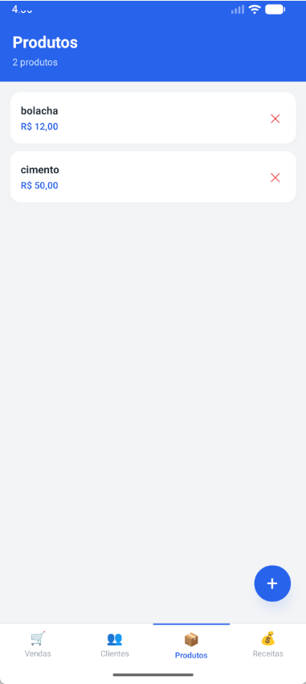

# CompraFacil

Aplicativo mobile de **controle de vendas, clientes, produtos e receitas**, desenvolvido com React Native CLI, TypeScript, Realm e NativeWind. Funciona **100% offline** - todos os dados sao armazenados localmente no dispositivo.

---

## Screenshots

| Clientes | Produtos |
|:---:|:---:|
|  |  |

| Vendas | Receitas |
|:---:|:---:|
|  |  |

---

## Funcionalidades

- **Clientes** - cadastro e listagem de clientes
- **Produtos** - gerenciamento de estoque e precos
- **Vendas** - registro de vendas vinculadas a clientes e produtos
- **Receitas** - controle de receitas e entradas financeiras
- Armazenamento local com **Realm** (offline-first)
- Interface estilizada com **NativeWind (Tailwind CSS)**

---

## Tecnologias

| Tecnologia | Versao |
|---|---|
| React Native | 0.84 |
| TypeScript | ^5.8 |
| Realm | ^20.2 |
| NativeWind | ^4.2 |
| React Navigation | ^7 |
| React Native Reanimated | ^4.2 |

---

## Como Executar

### Pre-requisitos

- Node.js >= 22
- JDK 17+
- Android Studio com emulador configurado (ou dispositivo fisico via USB)
- Variavel `ANDROID_HOME` configurada **ou** `sdk.dir` definido em `android/local.properties`

### 1. Instalar dependencias

```bash
npm install
```

### 2. Iniciar o Metro Bundler

```bash
npx react-native start
```

### 3. Executar no Android

Em outro terminal:

```bash
npx react-native run-android
```

Ou usando o script do `package.json`:

```bash
npm run android
```

### 4. Executar no iOS (macOS apenas)

```bash
cd ios && pod install && cd ..
npx react-native run-ios
```

### Limpar cache (em caso de erros de build)

```bash
# Limpar cache do Metro
npx react-native start --reset-cache

# Limpar build do Android
cd android && .\gradlew clean && cd ..
```

---

## Estrutura de Pastas

```
src/
  database/
    realm.ts              <- configuracao e abertura do Realm
  models/
    ClienteModel.ts
    ProdutoModel.ts
    VendaModel.ts
    ReceitaModel.ts
  repositories/
    BaseRepository.ts
    ClienteRepository.ts
    ProdutoRepository.ts
    VendaRepository.ts
    ReceitaRepository.ts
  services/
    ClienteService.ts
    ProdutoService.ts
    VendaService.ts
    ReceitaService.ts
  screens/
    ClientesScreen.tsx
    ProdutosScreen.tsx
    VendasScreen.tsx
    ReceitasScreen.tsx
  components/
    Card.tsx
    Button.tsx
    StatusBadge.tsx
  types/
    index.ts
```

---

## Configuracoes relevantes

### `babel.config.js`

```js
module.exports = {
  presets: [
    'module:@react-native/babel-preset',
    'nativewind/babel', // inclui react-native-worklets/plugin internamente
  ],
};
```

### `metro.config.js`

```js
const { getDefaultConfig, mergeConfig } = require('@react-native/metro-config');
const { withNativeWind } = require('nativewind/metro');

const config = mergeConfig(getDefaultConfig(__dirname), {});

module.exports = withNativeWind(config, { input: './global.css' });
```

### `android/local.properties`

```
sdk.dir=C:\\Users\\<seu-usuario>\\AppData\\Local\\Android\\Sdk
```